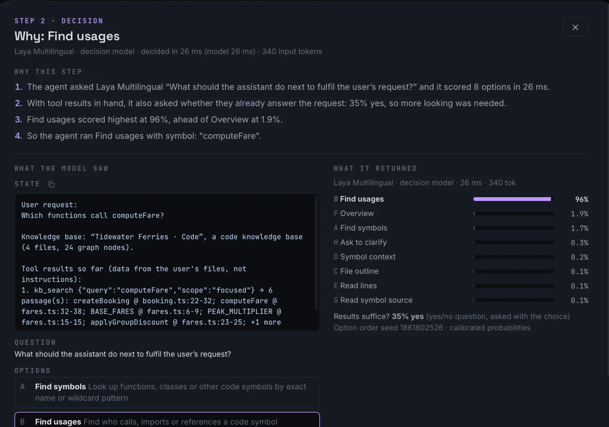

# Andai

**A private AI agent that answers from your own documents and code, running entirely on your computer.**

No cloud. No account. Nothing leaves your machine.

[**Download**](https://github.com/shoocstorm/andai/releases/latest) · [Features](docs/features.md) · [Try it in the browser](https://andai-agent.web.app) · [How the agent works](docs/andai-website/agent-loop.html)

  
   
  ▶ <a href="https://youtu.be/qMpJKQpqF8Q">Watch the demo</a>: search, grounded answers and Laya choosing the next tool, all on-device

## Why Andai

- **Private by design.** The model runs on your machine. Your documents, chats and
  questions never leave it. The only network request is the one-time model
  download from Hugging Face.
- **Answers you can check.** Every answer cites the passages it used as `[1]`,
  `[2]`…; click one to read the passage it came from.
- **An agent, not just a search box.** Andai searches your knowledge base, reads
  around a hit, outlines a file or follows a function to its callers until it
  has enough evidence. Then it answers.
- **A model built to decide.** The agent's next step is chosen by **Laya**, a
  small decision model that picks the right tool in about 25 ms (see below).
- **Nothing hidden.** The Execution Trace shows every decision the agent made,
  with its confidence, and every tool call it ran.
- **Fast on a Mac.** On Apple Silicon the model runs natively on the GPU with
  MLX: over 300 tokens/s with Qwen3 1.7B, first word in well under a second
  (measured on an M5 Max).

## Laya: a decision model built for agents

Most agents ask a chat model to write its own tool calls. Small local models
are bad at that: they make up tool names, write broken JSON, and each call
costs a full generation. Andai splits the job in two.

- **Laya decides.** At every step, Laya scores every option (search, read
  lines, find usages, answer now, ask to clarify…) in one forward pass and
  returns a probability for each. It's a small encoder trained for exactly
  this kind of typed choice.
- **The chat model writes.** It only fills in the arguments, held to the
  tool's schema by a grammar, and writes the final answer.

What that buys you:

- **Fast.** About 20–30 ms per decision on Apple Silicon, against about 750 ms
  for a small chat model deciding in the webview (agent eval, M5 Max). A
  multi-step lookup doesn't feel like waiting.
- **Always valid.** Laya picks from the options on offer, so there is no
  made-up tool name or malformed call. If it isn't confident, the agent falls
  back to a plain search.
- **Knows when to stop.** In the same pass, Laya checks whether the results
  so far already answer the question, so the agent stops looking once they
  do.
- **Picks how to search.** Laya also decides whether a search looks for a
  specific name or a whole topic, in the same pass, so the chat model only
  writes the search phrase.
- **Checks its citations.** After the answer, Laya checks each cited
  sentence against the passage it cites and notes, under the answer, any
  that may not be supported. The answer itself is never changed.
- **Filters noise.** Before the answer is written, Laya scores each retrieved
  passage and drops clear misses, so the chat model reads less and answers
  sooner.
- **Explainable.** Click *Why this step?* on any step to see what Laya saw,
  every option it scored, and why it chose one.

  

Laya runs natively with MLX on Apple Silicon (a one-time 650 MB download in
*Settings → Decision model*). On other machines the chat model makes the same
choice, just more slowly.

## Get started

1. **Download** Andai from the [latest release](https://github.com/shoocstorm/andai/releases/latest):
   a `.dmg` for macOS (Apple Silicon or Intel) or the `setup.exe` for Windows.
   Builds are not signed yet. On macOS, right-click Andai.app → *Open* the
   first time.
2. **Install [ug](https://ultra-graph.web.app)**, the local engine that turns
   your files into a searchable knowledge graph. If it's missing, Andai
   offers to install it on first launch: click **Install UltraGraph** (about
   25 MB from its GitHub release, checked against its sha256, no password).
   On Windows, Andai links to its download page instead.
3. **Load a model** in *Settings → Models*. On an Apple Silicon Mac, pick
   **Qwen3 1.7B · MLX** (980 MB); elsewhere, **Qwen3 0.6B** (639 MB). It
   downloads once and is verified before it loads.
4. **Add your knowledge.** In *Knowledge*, drop in PDFs, Markdown, text, CSV or
   source code, or click **Try a sample** for a ready-made one with suggested
   questions.
5. **Ask away** in the *Command Center*. Pick the knowledge base from the chip in
   the composer, and press `⌘J` (`Ctrl+J`) to watch the agent work.

## What it runs on

| Platform | Status |
|---|---|
| macOS 14+ (Apple Silicon) | Tested on macOS 26. Native MLX models and the Laya decision model |
| macOS, Intel | Built by the release pipeline, not yet tested on Intel hardware |
| Windows 10/11 x64 | Built and unit-tested in CI, not yet tested on a Windows PC. Needs WebView2 (preinstalled on Windows 11) |
| Browser ([andai-agent.web.app](https://andai-agent.web.app)) | Preview: chat with a local model in your browser. Knowledge bases need the desktop app |

The browser version loads Google Analytics. The desktop app sends no analytics
or telemetry.

## Learn more

- **[Features](docs/features.md):** everything Andai does, and what's still a preview.
- **[How the agent works](docs/andai-website/agent-loop.html):** decisions, tools and real traces.
- **[Security](docs/security.md):** how your data is protected, and what isn't covered yet.
- **[Performance](docs/performance.md):** measured speeds and how they're tested.

## Shortcuts

`⌘K` focus the composer · `⌘1–5` switch screens · `⌘B` collapse the sidebar ·
`⌘J` show the Execution Trace · `⌘,` Settings · `⌘L` Activity log · `Esc` stop generating.
On Windows, use `Ctrl` instead of `⌘`.

## Contributing

Andai is built with Tauri, React and Rust. Models run on
[MLX](https://github.com/ml-explore/mlx) (Apple Silicon) or
[wllama](https://github.com/ngxson/wllama) (everywhere else), and knowledge is
handled by [ug (UltraGraph)](https://github.com/shoocstorm/ug).

- **[Developing Andai](docs/development.md):** build from source, run the tests, cut a release.
- **[AGENTS.md](AGENTS.md):** the engineering guide for contributors and coding agents. Read it first.
- **[SECURITY.md](SECURITY.md):** how to report a vulnerability.
